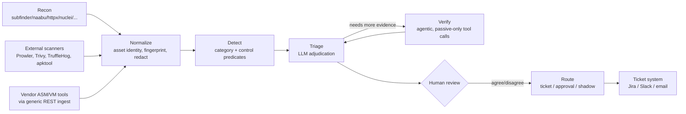
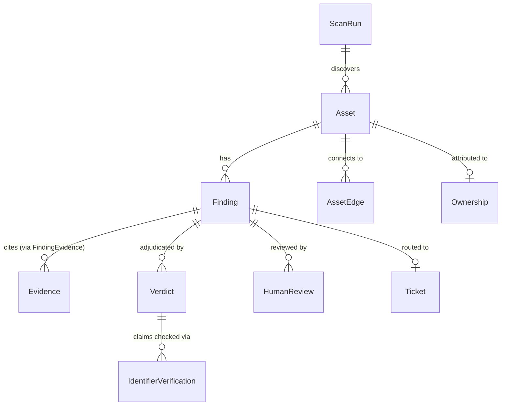

# Architecture

This is the how-it-works reference: pipeline flow, component responsibilities,
data model, and the safety invariants that hold across all of it. `CLI.md` is
the command-by-command workflow reference; `THIRD_PARTY_TOOLS.md` lists every
wrapped scanner and its license; `AUTHORIZATION.md` covers the active-scan
authorization gate in detail. This file is the connective tissue between them.

## The problem this solves

Attack surface discovery is a commodity — `subfinder`, `naabu`, `httpx`,
`nuclei`, and a dozen other excellent OSS tools already do it well. What every
team drowning in their output actually lacks is three things: **adjudication**
(is this finding real, in this specific environment, right now?),
**attribution** (whose asset is this, and who can actually fix it?), and
**routing** (does the ticket reach that person, with enough evidence attached
that they don't have to start over?). kiyooo is built around those three
verbs. It orchestrates existing scanners rather than replacing them, and adds
an LLM-adjudication layer, an ownership-resolution layer, and a routing layer
on top.

## Pipeline overview

Every arrow that crosses into a target's own infrastructure — recon's active
adapters (`naabu`, `httpx`, `tlsx`, `katana`, `nuclei`) and the verify
stage's tool calls — passes through **ScopeGuard** first (see
[Invariants](#invariants-enforced-in-code-not-just-here) below). Every other
arrow is data flowing through this process; no packets involved.

## Component walkthrough

Each of these is a top-level package under `kiyooo/`, and each one is
independently testable — see `tests/<same name>/`.

| Package | Responsibility |
|---|---|
| `recon/` | Wraps discovery/probing tools (`subfinder`, `naabu`, `httpx`, `tlsx`, `katana`, `nuclei`, `amass`, `dnsx`, and OSINT sources). `scope.py` is ScopeGuard, `orchestrator.py` sequences adapters by profile (`passive` / `standard` / `deep`). |
| `normalize/` | Turns raw tool output into a stable `Asset` identity, computes the dedupe fingerprint (survives rescans), and redacts any secret found in evidence before it goes any further (`redact.py`). `injection.py` neutralizes evidence content so it's never interpreted as an instruction by the LLM stage. |
| `detect/` | The category/control rules engine — `engine.py` matches category YAML `detect:` predicates against evidence, `controls.py` applies compensating-control suppression/severity-reduction, `predicates.py` is the shared predicate library both use. |
| `graph/` | The asset graph: `builder.py` maintains `Asset`/`AssetEdge` from scan results, `snapshot.py` versions it per scan run for diffing, `queries.py` is the (deliberately minimal — exact-match AND only) query surface, `attack_path.py` computes correlated multi-hop paths on demand. |
| `diff/` | Compares consecutive `AssetSnapshot`s and emits `ChangeEvent` rows — the change feed's data source. |
| `enrich/` | Attribution and context: cloud-account tagging (`cloud_aws.py`/`cloud_gcp.py`), ownership resolution (`ownership/` — an 8-source confidence table, IaC tags to CODEOWNERS to Slack directory), tech fingerprinting, EPSS/KEV enrichment. |
| `ingest/` | Vendor/file import — a generic REST connector (`adapters/generic_rest.py`) plus hand-written adapters (Prowler, Trivy, TruffleHog, Mandiant, Tenable, mobile static analysis) and CSV/JSONL file importers. Every imported item still goes through `mapper.py`'s vendor→category mapping and the same detect/triage pipeline as anything found by recon — nothing bypasses adjudication because it came from a different source. |
| `llm/` | Model routing (`router.py` picks bulk vs. escalation model + enforces a per-run cost ceiling), provider adapters (Anthropic, OpenAI, Ollama, any OpenAI-compatible endpoint), cost calculation. |
| `triage/` | The adjudication core. `agent.py` runs the LLM pass(es) — bulk first, escalating to a stronger model when the bulk pass's confidence is low or it explicitly asks for more evidence. `bundler.py` builds the evidence bundle sent to the model (shrunk to fit budget, never dropped entirely). `validator.py` rejects any model claim not backed by a cited evidence ID, and separately verifies cited identifiers (CVE/CWE/version/hostname) against authoritative sources (NVD/KEV/OSV/DNS) — see `IdentifierVerification`. `cache.py` skips re-calling the model on an unchanged rescan (same evidence, same prompt version, same model). `memory.py` retrieves similar past human decisions via pgvector similarity. |
| `verify/` | Agentic follow-up verification when the model's bulk pass isn't confident enough to decide — but only ever passive confirmation calls (DNS resolution, a TLS handshake, an HTTP probe, a TCP banner grab, a single nuclei template), each still gated by ScopeGuard, capped at a small number of rounds. |
| `route/` | Ticket routing. `policy.py` resolves the responsible team/sink from ownership, `autonomy.py` decides shadow/draft/auto-file per category's configured autonomy level, `ticket_contract.py` renders and lints the ticket body, `pipeline.py` batches by `cluster_id` so 40 instances of the same root cause become one ticket, not 40. `sinks/` are the actual integrations (a base interface — Jira/Slack/email are the org's own to configure). |
| `feedback/` | Closes the loop: `agreement.py` computes model/human agreement per category+model+prompt-version (the dashboard's core metric), `promote.py` proposes a `suppressions.yaml` diff after repeated identical human overrides — always a PR a human merges, never an automatic edit. |
| `skills/` | Optional per-category prompt add-ons (`loader.py`) for guidance a YAML `triage_hints` field can't express cleanly (e.g. house style for a specific ticket template). |
| `eval/` | The offline accuracy harness — runs triage against a labeled corpus and reports precision/recall, deliberately never run in CI (calls a real model). |
| `worker/` | Scheduling (`schedule.py`) and background task definitions (`tasks.py`) for recurring scans and metrics rollups. |
| `metrics/` | Prometheus-format metrics (`prom.py`) and product-health computations (`health.py`) — including which metrics are misleading in isolation (e.g. `findings_surfaced_per_analyst_per_week` alone is a trap: it rewards noisy detection, not correct triage). |
| `db/` | SQLAlchemy 2.0 models (`models.py`) and the repository layer (`repo/`) — one repository class per table, no raw ORM queries scattered through business logic. |
| `api/` | FastAPI app — one router per resource area, all under `/api/*`; see [API surface](#api-surface) below. |
| `cli.py` | Typer CLI — one command group per workflow area; mirrors the API 1:1 for anything that has both (Part D parity: the two never duplicate logic, they call the same underlying functions). |

## Data model

The core entities, and how a finding actually gets from "recon saw something"
to "a human decided":

- **`Asset`** — a stable identity (domain, IP, cloud resource, repo, mobile
  app, LLM endpoint, MCP server, ...) with a `raw_severity`-independent
  lifecycle; `AssetType` has 20+ variants across conventional and AI surface.
- **`Finding`** — one detected issue on one asset, deduplicated by a stable
  `fingerprint` so a rescan updates `last_seen` rather than creating a
  duplicate. `FindingStatus` (`new` → `triaging`/`triaged` → `routed` → ...)
  is the state machine every finding moves through — see
  [Invariants](#invariants-enforced-in-code-not-just-here) for exactly what's
  allowed to move it.
- **`Verdict`** — one LLM adjudication pass's output: `verdict`
  (`true_positive`/`false_positive`/`not_exploitable`/`needs_human`),
  confidence, adjusted severity, reasoning, cited evidence IDs, cost, and the
  exact model + prompt version used. A finding can have several over its
  lifetime (re-triage after new evidence).
- **`HumanReview`** — a person's actual decision: agreed or disagreed with
  the verdict, their own final verdict, and a rationale. This is the only
  thing that can move a finding past `triaged`.
- **`Evidence`** / **`FindingEvidence`** — the raw material (HTTP responses,
  DNS records, cert chains, vendor payloads) a finding cites, linked with a
  role (`primary`/`supporting`/`context`).
- **`IdentifierVerification`** — every CVE/CWE/version/hostname the model
  cited, and what checking it against an authoritative source actually
  found. `status: hallucinated` is the case that matters most.
- **`Ticket`** / **`Approval`** — the routing outputs: a filed/reopened
  ticket, or a draft awaiting a human's explicit approval before anything
  sends.
- **`ExternalFindingSource`** / **`ExternalFindingRaw`** — one configured
  connection to a vendor tool (Prowler, Trivy, TruffleHog, a generic REST
  ASM/VM tool, ...) and the raw items it's imported, each tracked
  mapped/unmapped so nothing is silently dropped.
- **`AuditLog`** — every ScopeGuard decision (`ALLOW`/`DENY`/`REQUIRES_CONFIRM`),
  append-only, per invariant #2.

## Domain modules

Beyond core attack-surface discovery, five modules extend the same pipeline
into other domains — each wraps one real OSS/vendor scanner, and every
finding they produce goes through the identical detect → triage → route path
as anything recon found itself:

| Module | Wraps | Router / CLI group |
|---|---|---|
| Cloud posture | Prowler (AWS/Azure/GCP/Kubernetes) | `kiyooo/api/routers/cloud.py`, `kiyooo cloud` |
| Containers & Kubernetes | Trivy | `kiyooo/api/routers/containers.py`, `kiyooo containers` |
| Source code & supply chain | TruffleHog (verified live secrets only) | `kiyooo/api/routers/repos.py`, `kiyooo repos` |
| Mobile (Android) | apktool + TruffleHog filesystem scan | `kiyooo/api/routers/mobile.py`, `kiyooo mobile` |
| Attack paths | Computed over the live asset graph, no external tool | `kiyooo/api/routers/attack_paths.py` |

Each of the first four follows the same shape: a config (credentials via
`credential_ref` pointers, never raw secrets), a list/create/update endpoint,
and a sync/scan action that runs the real tool and imports its output through
the shared ingest pipeline.

The **AI attack-surface module** is architecturally different: it's native
passive fingerprinting (`detect/ai_fingerprints.py`), not a wrapped external
tool — it finds LLM endpoints, MCP servers, vector stores, model registries,
notebook servers, and shadow AI SaaS tenants the same way recon finds a
subdomain or an open port, and its 10 categories live under
`org-context.example/categories/05-ai-assets/`.

## Web UI & API surface

FastAPI backend (`kiyooo serve`, OpenAPI at `/openapi.json`) + Next.js
frontend (`web/`). Every backend router has a corresponding UI page:

`assets` · `findings` (+ `review`, `ownership`) · `changes` · `scan-runs` ·
`coverage` · `categories` · `dashboard` · `teams` · `organizations` · `seeds`
· `exclusions` · `model-pins` · `ingest` · `cloud` · `containers` · `repos` ·
`mobile` · `attack-paths` · `module-toggles`

`module-toggles` is genuine per-organization control: cloud/containers/repos/
mobile/attack-paths can each be switched off in Settings, and a disabled
module's page shows a plain "enable this" prompt instead of hiding the nav
entry — visible, not silently absent.

## CLI surface

One Typer group per workflow, mirroring the API for anything both expose:
`org`, `seed`, `exclusion`, `providers`, `scan`, `detect`, `triage`,
`feedback`, `route` (+ `route approvals` — the human-in-the-loop queue),
`assets`, `modules`, `events`, `categories`, `eval`, `ingest` (+ `ingest
sources`), `cloud` (+ `cloud accounts`), `containers` (+ `containers scans`),
`repos` (+ `repos scans`), `mobile`. `CLI.md` has the full reference with
real flags and a start-to-ticket walkthrough.

## Invariants enforced in code, not just here

These aren't aspirations — each one is checked by code, and a test exists
for the check itself:

1. **No exploitation primitives, ever.** Verification proves reachability
   and configuration, never compromise: no credential submission, no
   default-password attempts, no fuzzing, no writes to a target. Nuclei is
   always invoked with `-etags dos,intrusive,fuzz`.
2. **All outbound network activity routes through `ScopeGuard`**
   (`kiyooo/recon/scope.py`), enforced at the adapter layer. Every decision
   — `ALLOW`/`DENY`/`REQUIRES_CONFIRM` — writes an `AuditLog` row before any
   packet goes out.
3. **Passive by default.** Active scanning needs `active_scanning_enabled:
   true` *and* `attestation: true` in `scope.yaml` *and* the `--active` CLI
   flag — checked twice (config-load validation, then again before the run
   starts).
4. **The LLM has no authority.** It produces a `Verdict` with cited evidence
   IDs; the validator rejects any claim without one. It never sets scope,
   never sends a packet, never auto-suppresses a finding, never closes one —
   see `FindingStatus`: nothing moves a finding past `triaged` except a
   `HumanReview`.
5. **Evidence is data, never instruction.** Scanned content is
   attacker-controlled — `normalize/injection.py` neutralizes it before it
   enters a prompt; an instruction found inside evidence becomes a finding
   to report, not a command the model follows.
6. **A human approves outbound.** `route/autonomy.py`'s 4-level ladder (0
   shadow — nothing sent; 1 everything drafted and held; 2 auto-routes
   low/medium but still holds high/critical for approval; 3 everything
   auto-files) is a per-category config value, promoted only via a
   reviewable diff — never a runtime decision the model makes.
7. **Secrets are redacted at ingest.** `normalize/redact.py` stores type,
   location, and a partial hash — never a live credential in evidence, logs,
   or a ticket body.
8. **Models are pinned.** A model digest or prompt-version change is a
   change to detection logic — `ModelPin` records exactly what's active, and
   changing it is meant to require an eval re-run.

## Demo labs

`labs/` proves the above against something closer to a real environment than
a unit-test fixture, not just against fixtures:

- **`acmecorp/`** — conventional attack surface in Docker Compose: an
  exposed database, a leaked secret, an expired/clustering TLS cert, a
  correctly-suppressed SSO false-positive, a severity-reduced WAF case, and
  200 rows of vendor noise to show the ingest gap-visibility guarantee.
- **`kiyoo-ai/`** — the AI attack-surface equivalent: MCP servers (a
  harmless one and a dangerous one, to show catalog-aware triage actually
  matters), a vector store, a model registry, a notebook server, a shadow AI
  SaaS tenant.
- **`kiyoo-range/`** — a single interactive front door onto both, one page
  per shipped category (all 23), each with a live-evidence button. Needs
  neither lab running to give a concrete look at every category — offline,
  it falls back to a real captured example response, clearly labeled as
  such, never a bare connection error.

See `labs/README.md` for the fastest way to look at any of this running.
