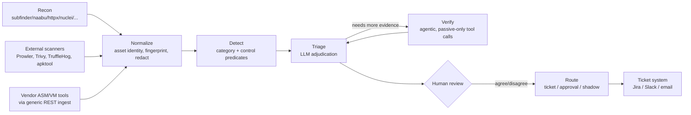

<p align="center">
  
</p>

# kiyooo

An open-source, AI-triaged Attack Surface Management platform.

Discovery is the commodity part — this wraps existing OSS recon tools rather than
reimplementing them. What it actually does: **adjudicates** whether a finding is
real in your environment, **attributes** it to the person who can fix it, and
**routes** it to them with proof it was real and proof it's fixed.

**See [`ARCHITECTURE.md`](ARCHITECTURE.md)** for the full pipeline diagram,
component-by-component walkthrough, data model, and the safety invariants
enforced in code — the how-it-works reference for reviewers. `CLI.md` is the
command-by-command workflow reference.

## Pipeline



Every arrow that touches a target's own infrastructure passes through
**ScopeGuard** first; the LLM never sets scope, sends a packet, or closes a
finding — only a `HumanReview` can. Full breakdown of every box above,
plus the data model and all safety invariants, is in
[`ARCHITECTURE.md`](ARCHITECTURE.md).

## Status

The full pipeline is built end to end: recon orchestration,
normalization/graph/diff, enrichment/ownership, the detection rules engine,
LLM triage, agentic verification, external-findings import, routing &
ticketing, the human feedback loop, the skills system, scheduling/metrics/
secret-redaction, and a FastAPI backend + Next.js UI (`kiyooo serve` + `web/`).

### Domain modules — traditional infrastructure

Five modules extend the same detect → triage → route pipeline into other
domains, wired into both the CLI and the web UI, each wrapping a real OSS
scanner rather than reimplementing one:

| Module | Wraps | Router / CLI group |
|---|---|---|
| **Cloud posture** — AWS/Azure/GCP/Kubernetes account audits | Prowler | `kiyooo/api/routers/cloud.py`, `kiyooo cloud` |
| **Containers & Kubernetes** — image/cluster scans | Trivy | `kiyooo/api/routers/containers.py`, `kiyooo containers` |
| **Source code & supply chain** — verified live-secret scanning | TruffleHog | `kiyooo/api/routers/repos.py`, `kiyooo repos` |
| **Mobile (Android)** — static APK analysis | apktool + TruffleHog | `kiyooo/api/routers/mobile.py`, `kiyooo mobile` |
| **Attack paths** — computed on demand over the live asset graph | no external tool | `kiyooo/api/routers/attack_paths.py` |

### AI attack-surface module

Architecturally different from the five above: **native passive
fingerprinting**, not a wrapped external tool
(`kiyooo/detect/ai_fingerprints.py`). It finds LLM endpoints, MCP servers,
vector stores, model registries, notebook servers, and shadow AI SaaS
tenants the same way recon finds a subdomain or an open port — 10 categories
under `org-context.example/categories/05-ai-assets/`.

### Demo labs

Three labs under `labs/` prove the above against something closer to a real
environment than a unit-test fixture:

| Lab | Covers | Setup |
|---|---|---|
| **`acmecorp/`** | Conventional attack surface — exposed database, leaked secret, expired/clustering TLS cert, a correctly-suppressed SSO false-positive, a severity-reduced WAF case, 200 rows of vendor noise | Docker Compose (`docker compose up`) |
| **`kiyoo-ai/`** | AI attack surface — MCP servers (harmless + dangerous, to show catalog-aware triage matters), a vector store, a model registry, a notebook server, a shadow AI SaaS tenant | Docker Compose |
| **`kiyoo-range/`** | Single interactive front door onto both labs — all 23 shipped categories, one page each, live-evidence button. Falls back to a labeled real captured example when the backing lab isn't running — never a bare connection error | `.venv/bin/python -m uvicorn` — one port, no sudo |

See [`labs/README.md`](labs/README.md) for the fastest way to look at any of
this running.

Each area's own module docstrings call out what's real-and-tested versus
real-but-unverified-without-live-infra (a live Postgres, a Docker daemon, a
real LLM provider) in a given environment — that distinction is stated
explicitly wherever it applies, never silently assumed away.

## What each command actually does to the network

| Command | Sends packets to your targets? |
|---|---|
| `kiyooo doctor` | No — checks your own infra (DB/redis/minio/LLM provider) and validates org-context. |
| `kiyooo scan --explain` | No — prints the table below (tool, stage, `is_active`, what it reads, rate cap) and exits. Reads nothing, contacts nothing. |
| `kiyooo scan --dry-run` | No — resolves seeds, prints the exact command line each adapter would run, executes none of them. `ScopeGuard` is not even consulted, so nothing is denied or allowed — this is a preview, not a scope check. |
| `kiyooo scan` (no `--active`) | Only the passive adapters below run. Every target still passes `ScopeGuard`; a target outside `scope.yaml` is skipped and logged, never contacted. |
| `kiyooo scan --active` | Requires `active_scanning_enabled: true` **and** `attestation: true` in `scope.yaml`, checked before anything runs; refuses otherwise. Prints an authorization banner (`authorized_by`, `authorization_date`) at start, per `AUTHORIZATION.md`. Every `ScopeGuard` decision — `ALLOW`, `DENY`, or `REQUIRES_CONFIRM` — is written to the append-only `audit_log` table before any packet goes out. |

**Every adapter, what it actually touches, and its default rate cap** — the same
table `kiyooo scan --explain` prints, kept here so it doesn't drift silently:

| Tool | Stage | Sends packets to target? | Reads |
|---|---|---|---|
| `subfinder` | discover | No | Public passive-DNS / certificate-transparency sources |
| `crtsh` | discover | No | crt.sh's certificate transparency log |
| `amass` (passive) | discover | No | Public passive-DNS / OSINT sources |
| `shodan` | discover | No | Shodan's own database about the target IP |
| `censys` | discover | No | Censys's own database about the target IP |
| `dnsx` | resolve | No | The target's DNS resolver (standard name resolution) |
| `naabu` | portscan | **Yes** | The target's own TCP ports (SYN/connect probe) |
| `httpx` | probe | **Yes** | The target's own HTTP service (a real HTTP request) |
| `tlsx` | probe | **Yes** | The target's own TLS listener (a real TLS handshake) |
| `katana` | crawl | **Yes** | The target's own web pages (crawls live links) |
| `nuclei` | scan | **Yes** | The target's own HTTP service — invoked with `-etags dos,intrusive,fuzz` and a conservative template-tag allowlist, always |

`--profile passive` runs only the `discover`/`resolve` rows. `--profile standard`
adds `probe`. `--profile deep` adds `portscan`/`crawl`/`scan` — the only stages
that send packets to a target at all.

## Requirements

- Python 3.12
- [`uv`](https://docs.astral.sh/uv/)
- Docker (Postgres, Redis, MinIO via `docker-compose.yml`)

## Getting started

```bash
uv sync
cp .env.example .env   # adjust if your Postgres/Redis/MinIO aren't on localhost defaults
make dev                # docker compose up -d + alembic upgrade head
uv run kiyooo doctor
```

`kiyooo doctor` checks Postgres, Redis, MinIO, LLM provider reachability, and that
`org-context.example/` (or whatever `KIYOOO_ORG_CONTEXT_PATH` points at) parses and
validates cleanly. A malformed category fails the check — it never silently skips.

See **[`CLI.md`](CLI.md)** for the full command reference — every command grouped
by workflow (scope, scan, triage, route, ingest, ...), with real flags and a
start-to-ticket walkthrough.

## API & web UI

```bash
uv run kiyooo serve   # FastAPI backend on :8000, OpenAPI at /openapi.json
cd web && npm install && cp .env.local.example .env.local && npm run dev
```

No auth on either side yet — RBAC/SSO is a deferred Stage 11 item (see
`kiyooo/api/deps.py`). Run behind a trusted network until that lands.

## Org context

`org-context.example/` is a template. A real deployment forks this into its own
git repo — `scope.yaml`, `teams.yaml`, `controls.yaml`, and `categories/*.yaml` are
how you customize detection and routing without touching this codebase.

## Engineering standards

Python 3.12, `uv`, `ruff`, `mypy --strict` on `kiyooo/`. Pydantic v2 at every
boundary. Alembic migration for every schema change. Safety invariants held
throughout: no exploitation primitives, all outbound network activity routes
through `ScopeGuard`, a human approves every outbound message, and models are
pinned (a model/prompt-version change requires an eval re-run and a changelog
entry).

## License

MIT — see `LICENSE`.
